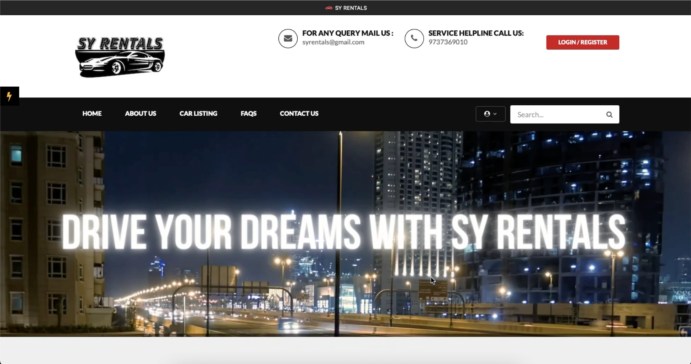

# Car-Rental-System
SYRentals is a software platform designed to provide customers with easy access to rental vehicles. The system is designed to streamline the rental process, making it quick and convenient for customers to book a car online. In this particular system, the rental process is made easy with just a few clicks on the website.

# Description
The SYRentals platform is backed by a MySQL database, which stores all of the user and vehicle details. This ensures that the system is secure and reliable, and that all customer information is kept safe.

SYRentals boasts a large and diverse fleet of vehicles, including sedans, SUVs, and luxury cars, giving customers plenty of options to choose from. The vehicles are regularly serviced and maintained to ensure that they are in excellent condition and provide the highest level of comfort and safety.

Using the SYRentals platform is easy and straightforward. Customers can access the website or mobile app and enter their details, including the date and time they wish to rent a car. The system then displays all available vehicles, along with their details and rental rates. Customers can select their preferred vehicle and complete the rental process with just a few clicks.

SYRentals also offers various features designed to make the rental process even more convenient for customers. This includes online payment processing, vehicle delivery and pickup, and 24/7 customer support.

Overall, SYRentals is a reliable and convenient option for customers who are looking for a hassle-free way to rent a car. With its easy-to-use platform, large fleet of vehicles, and advanced features, SYRentals is designed to provide customers with a high-quality rental experience.

# Screenshots

